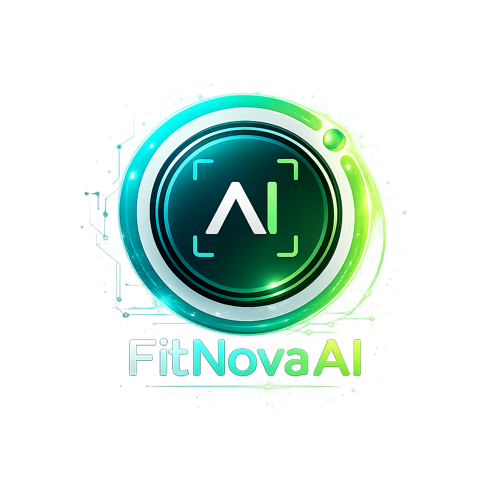

<div align="center">



# FitNovaAI

### AI-Powered Real-Time Fitness Coach

Pose Detection • Rep Counting • Voice Coaching • Workout History

<br>


</div>

---

## Overview

**FitNovaAI** is an AI-powered gym coaching platform that transforms a webcam into a real-time personal trainer.

It tracks body posture, counts exercise repetitions, detects form issues, stores workout progress, and delivers short voice-based coaching cues while the user trains.

The system is designed for a premium fitness dashboard experience with a clean Streamlit interface, live camera analysis, user accounts, and workout history.

---

## Why FitNovaAI?

Traditional workout apps ask users to manually enter progress after exercising. FitNovaAI watches the workout as it happens.

It combines computer vision, movement-specific exercise logic, and AI-generated coaching feedback to create a smarter training experience.

<div align="center">

| Smart Tracking | AI Coaching | Progress History |
| --- | --- | --- |
| Detects body landmarks in real time | Speaks short, useful form cues | Saves workouts per user |
| Counts reps automatically | Reacts to workout events | Summarizes reps, sets, and time |
| Tracks exercise-specific metrics | Encourages safer movement | Builds a personal training record |

</div>

---

## Features

### Real-Time Workout Tracking

- Live webcam-based pose detection
- MediaPipe Pose Landmarker integration
- OpenCV-powered frame processing
- Skeleton overlay on live video
- No-pose warning when the user moves out of frame

### Exercise Intelligence

- Automatic rep counting
- Set completion detection
- Workout completion detection
- Exercise-specific form metrics
- Live dashboard updates during training

### AI Voice Coach

- Groq-powered coaching text generation
- gTTS voice playback
- Motivational workout start cues
- Set completion feedback
- Form correction feedback
- Workout completion feedback

### User Dashboard

- Sign up and login
- Password hashing
- Personalized display name
- Sidebar workout planner
- Current set, total reps, and completed sets
- Workout history table

---

## Supported Exercises

| Exercise | Metrics Tracked |
| --- | --- |
| Squats | Knee angle, back angle, depth status |
| Push-ups | Elbow angle, body alignment, hip position |
| Biceps Curls | Elbow angle, shoulder stability, swing detection |
| Shoulder Press | Elbow angle, arm extension, back arch |
| Lunges | Front knee angle, torso angle, balance status |

---

## Tech Stack

| Category | Technologies |
| --- | --- |
| Frontend | Streamlit |
| Computer Vision | MediaPipe, OpenCV |
| Camera Streaming | streamlit-webrtc, WebRTC |
| AI Coaching | Groq |
| Text to Speech | gTTS |
| Data Processing | NumPy, pandas, PyAV |
| Database | SQLite |
| Language | Python 3.11 |

---

## System Architecture

```text
                         User
                          |
                          v

                   Streamlit Dashboard
                          |
                          v

                    WebRTC Camera Feed
                          |
                          v

                MediaPipe Pose Landmarker
                          |
                          v

                Exercise Detector Layer
        ------------------------------------------------
        |        |          |            |             |
        v        v          v            v             v
     Squats   Push-ups   Biceps      Shoulder       Lunges
                          Curls       Press

                          |
                          v

                Live Metrics + Rep Counter
                          |
              ------------|-------------
              |                        |
              v                        v
       Streamlit Session State   Voice Coaching Pipeline
                                      |
                                      v
                                Groq + gTTS

                          |
                          v

                  SQLite Workout History
```

---

## Project Structure

```bash
FitNovaAI
|
|-- main.py
|
|-- assets/
|   `-- fitnova-logo.png
|
|-- core/
|   `-- base_exercise.py
|
|-- detectors/
|   |-- squat.py
|   |-- pushup.py
|   |-- biceps_curl.py
|   |-- shoulder_press.py
|   `-- lunges.py
|
|-- services/
|   |-- auth/
|   |-- coaching/
|   |-- config/
|   |-- persistence/
|   |-- state/
|   |-- tracking/
|   |-- ui/
|   `-- vision/
|
|-- ml_models/
|   `-- pose_landmarker_full.task
|
|-- static/
|   |-- style.css
|   `-- AdobeClean.otf
|
|-- requirements.txt
|-- packages.txt
|-- runtime.txt
|-- LICENSE
`-- README.md
```

---

## Installation

### Clone Repository

```bash
git clone https://github.com/your-username/ai-gym-coach.git
cd ai-gym-coach
```

### Create Virtual Environment

```bash
python -m venv venv
```

### Activate Environment

Windows:

```bash
venv\Scripts\activate
```

Linux / macOS:

```bash
source venv/bin/activate
```

### Install Dependencies

```bash
pip install -r requirements.txt
```

---

## Environment Variables

Set your Groq API key before running the app.

Windows PowerShell:

```bash
$env:GROQ_API_KEY="YOUR_GROQ_API_KEY"
```

Linux / macOS:

```bash
export GROQ_API_KEY="YOUR_GROQ_API_KEY"
```

For Streamlit deployment, add the same key to app secrets.

---

## Run Application

```bash
streamlit run main.py
```

Application starts at:

```text
http://localhost:8501
```

---

## Workout Workflow

1. User signs in or creates an account
2. User selects exercise, sets, and reps
3. Camera stream starts through WebRTC
4. MediaPipe detects body landmarks
5. The selected detector tracks movement and counts reps
6. FitNovaAI updates live metrics on the dashboard
7. AI coach gives voice feedback when needed
8. Completed workout progress is saved to SQLite

---

## AI Coaching Workflow

1. Workout event is detected
2. Form issue is identified from live metrics
3. Coaching prompt is sent to Groq
4. Groq returns a short trainer-style cue
5. gTTS converts the cue into voice
6. Audio plays inside the Streamlit dashboard

---

## Database Tables

- users
- exercises

The local SQLite database stores account data and workout history.

---

## Key Concepts Used

### Computer Vision

- Pose detection
- Landmark tracking
- Skeleton rendering
- Joint angle calculation

### AI and Speech

- LLM-based coaching
- Prompt engineering
- Text-to-speech generation
- Event-based feedback

### Fitness Logic

- Rep counting
- Set tracking
- Form analysis
- Exercise-specific thresholds

### Software Engineering

- Modular architecture
- Authentication
- Local persistence
- Streamlit session state
- Real-time video processing

---

## Deployment

This project includes deployment-ready configuration files.

| File | Purpose |
| --- | --- |
| `runtime.txt` | Pins Python 3.11 |
| `packages.txt` | Adds Linux packages needed by OpenCV and MediaPipe |
| `requirements.txt` | Installs Python dependencies |

For Streamlit Community Cloud:

1. Push this project to GitHub
2. Set `GROQ_API_KEY` in Streamlit secrets
3. Use `main.py` as the app entry point
4. Keep `ml_models/pose_landmarker_full.task` in the repository

---

## Future Enhancements

- More exercises
- Weekly progress analytics
- Workout charts and streaks
- CSV export for workout history
- Configurable coaching intensity
- Cloud database support
- Mobile-friendly training mode
- Personalized workout recommendations

---

## Author

### Tanmayee Satpathy

B.Tech CSE

Kalinga Institute of Industrial Technology, Bhubaneswar

---

## License

This project is licensed under the **MIT License**.

See [LICENSE](LICENSE) for more information.

---

<div align="center">


### FitNovaAI

Train smarter. Move better. Let AI coach every rep.

</div>
