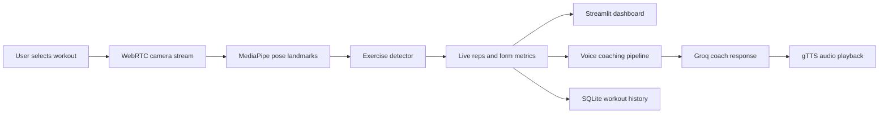

<div align="center">

# AI Gym Coach

### Real-time form tracking, rep counting, workout history, and AI voice coaching in one premium fitness dashboard.

<p>
  
  
  
  
  
</p>

<p>
  <a href="#experience">Experience</a>
  <span>&nbsp;.&nbsp;</span>
  <a href="#features">Features</a>
  <span>&nbsp;.&nbsp;</span>
  <a href="#quick-start">Quick Start</a>
  <span>&nbsp;.&nbsp;</span>
  <a href="#architecture">Architecture</a>
  <span>&nbsp;.&nbsp;</span>
  <a href="#deployment">Deployment</a>
</p>

</div>

---

## Experience

AI Gym Coach turns your webcam into a real-time personal training assistant. Pick a workout, set your target sets and reps, start the camera, and the app tracks your movement live using MediaPipe pose landmarks. As you train, it counts reps, monitors form quality, saves progress, and speaks short coaching cues powered by Groq and gTTS.

This is built as a focused training product, not a prototype screen: the app includes account creation, login, local workout history, exercise-specific metrics, a polished Streamlit interface, and a live camera overlay for body landmark feedback.

<table>
  <tr>
    <td><strong>Live coaching</strong><br>Short, useful voice cues when form issues appear or sets are completed.</td>
    <td><strong>Computer vision</strong><br>MediaPipe pose detection with custom detectors for each movement.</td>
    <td><strong>Workout memory</strong><br>SQLite-backed user accounts and per-user training history.</td>
  </tr>
  <tr>
    <td><strong>Premium interface</strong><br>Custom CSS, local typography, polished auth, sidebar planning, and dashboard cards.</td>
    <td><strong>Real metrics</strong><br>Angles, alignment states, depth checks, balance status, swing detection, and set progress.</td>
    <td><strong>Deployment-ready</strong><br>Python runtime pin, system package list, and clean dependency manifest.</td>
  </tr>
</table>

## Features

| Feature | Detail |
| --- | --- |
| Real-time pose tracking | Processes webcam frames with MediaPipe Pose Landmarker and OpenCV. |
| Rep counting | Uses exercise-specific stage transitions to count completed reps. |
| Form analysis | Tracks movement signals such as knee angle, elbow angle, hip status, back arch, depth, balance, and swing. |
| AI coaching | Sends workout events and detected form issues to a Groq-backed coach prompt. |
| Spoken feedback | Converts coaching text into audio with gTTS and plays it in the dashboard. |
| Workout planner | Lets users choose exercise, target sets, and reps before starting a session. |
| Authentication | Supports sign up, login, display names, password hashing, and logout. |
| Workout history | Saves completed reps, sets, time, exercise, user, and date in SQLite. |

## Supported Exercises

| Exercise | Live Metrics |
| --- | --- |
| Squats | Knee angle, back angle, depth status |
| Push-ups | Elbow angle, body alignment, hip position |
| Biceps Curls (Dumbbell) | Elbow angle, shoulder stability, swing detection |
| Shoulder Press | Elbow angle, arm extension, back arch |
| Lunges | Front knee angle, torso angle, balance status |

## Tech Stack

| Layer | Technology |
| --- | --- |
| App UI | Streamlit, custom CSS, AdobeClean font |
| Camera stream | streamlit-webrtc, WebRTC |
| Vision | MediaPipe, OpenCV, NumPy, PyAV |
| AI coach | Groq chat completions |
| Voice | gTTS |
| Data | SQLite, pandas |
| Runtime | Python 3.11 |

## Quick Start

### 1. Clone the repository

```bash
git clone https://github.com/your-username/ai-gym-coach.git
cd ai-gym-coach
```

### 2. Create and activate a virtual environment

```bash
python -m venv venv
```

```bash
# Windows
venv\Scripts\activate

# macOS / Linux
source venv/bin/activate
```

### 3. Install dependencies

```bash
pip install -r requirements.txt
```

### 4. Add your Groq key

Set `GROQ_API_KEY` before launching the app:

```bash
# Windows PowerShell
$env:GROQ_API_KEY="your_groq_api_key_here"

# macOS / Linux
export GROQ_API_KEY="your_groq_api_key_here"
```

For deployed Streamlit apps, add the same key to Streamlit secrets.

### 5. Run

```bash
streamlit run main.py
```

Open the local URL, allow camera access, sign in, and start a workout.

## How It Works



1. The user signs in or creates an account.
2. The user selects an exercise, sets, and reps.
3. The webcam stream is processed frame by frame.
4. Pose landmarks are passed into the selected exercise detector.
5. Reps, form metrics, and set progress update live.
6. Important workout events trigger AI-generated coaching cues.
7. Completed progress is saved locally and shown in workout history.

## Architecture

```text
ai-gym-coach/
|-- main.py                         # Streamlit app entry point
|-- core/
|   `-- base_exercise.py            # Shared angle and landmark utilities
|-- detectors/                      # Exercise-specific rep and form detectors
|   |-- squat.py
|   |-- pushup.py
|   |-- biceps_curl.py
|   |-- shoulder_press.py
|   `-- lunges.py
|-- services/
|   |-- auth/                       # Login, sign up, password hashing
|   |-- coaching/                   # LLM coach, TTS, voice orchestration
|   |-- config/                     # Exercise options, metric fields, prompt
|   |-- persistence/                # SQLite repository
|   |-- state/                      # Streamlit session defaults
|   |-- tracking/                   # Metric syncing and workout saving
|   |-- ui/                         # CSS/font injection helpers
|   `-- vision/                     # WebRTC video processor
|-- ml_models/
|   `-- pose_landmarker_full.task   # MediaPipe pose model asset
|-- static/
|   |-- style.css                   # Dashboard styling
|   `-- AdobeClean.otf              # Local font
|-- requirements.txt
|-- packages.txt
`-- runtime.txt
```

## Configuration

| Variable | Required | Purpose |
| --- | --- | --- |
| `GROQ_API_KEY` | Required for AI voice coaching | Enables Groq-powered coaching text generation. |

Without a valid Groq key, the vision and tracking flow can still be explored, but the AI voice coach will not initialize.

## Deployment

This repository includes the key files needed for hosted deployment:

| File | Purpose |
| --- | --- |
| `runtime.txt` | Pins Python 3.11. |
| `packages.txt` | Lists Linux packages required by OpenCV and MediaPipe. |
| `requirements.txt` | Installs the Python application dependencies. |

For Streamlit Community Cloud or similar platforms:

1. Push the repository to GitHub.
2. Set `GROQ_API_KEY` in app secrets.
3. Use `main.py` as the app entry point.
4. Ensure `ml_models/pose_landmarker_full.task` is included in the repository.

## Privacy

- Camera frames are processed live during the active app session.
- User accounts and workout history are stored in the local SQLite database.
- Coaching events and form-issue descriptions are sent to Groq only when the voice coaching pipeline requests feedback text.

## Roadmap

- Add weekly and monthly progress charts.
- Add CSV export for workout history.
- Add configurable coaching tone and frequency.
- Add more supported exercises.
- Add automated tests for detector thresholds and persistence flows.
- Add optional cloud database support for multi-device history.

## Contributing

Contributions are welcome. Strong contribution areas include new exercise detectors, better form metrics, visual history charts, accessibility improvements, and deployment hardening.

```bash
git checkout -b feature/your-feature
git commit -m "Add your feature"
git push origin feature/your-feature
```

Open a pull request with a short explanation of the change and how you tested it.

## License

Distributed under the MIT License. See [LICENSE](LICENSE) for details.

---

<div align="center">

<strong>AI Gym Coach</strong><br>
Train with better feedback, cleaner form, and a coach that keeps up with every rep.

</div>
